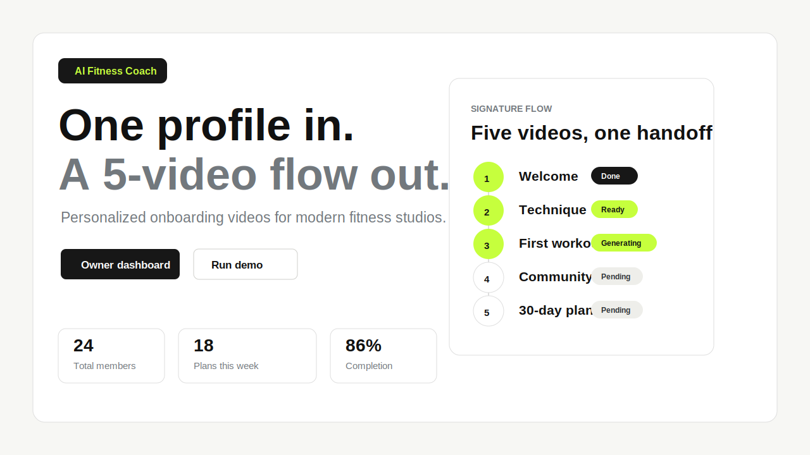
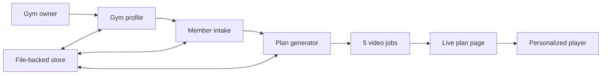

# AI Fitness Coach

[](https://nextjs.org/)
[](https://www.typescriptlang.org/)
[](https://ai-fitness-coach-spread.butterbase.dev/)

Premium fitness studio software that turns one gym profile and one member profile into a personalized five-video onboarding flow.

**Live demo:** [ai-fitness-coach-spread.butterbase.dev](https://ai-fitness-coach-spread.butterbase.dev/)



## Why It Exists

Most gyms lose new members before those members feel confident on the floor. AI Fitness Coach gives every new member a first-week welcome that feels personal without adding staff work.

The owner enters the studio equipment, class mix, and brand voice. Then they add a member goal, experience level, and limitations. The app generates a five-video onboarding plan: welcome, technique, first workout, community, and 30-day plan.

## Highlights

- End-to-end demo in under two minutes.
- Mock AI and mock video mode by default, so the project works with no API keys.
- Optional real Z.AI and Seedance/EasyRouter/ImaRouter mode through `.env.local`.
- File-backed persistence for local demos; refreshes keep gyms, members, plans, and video status.
- Premium judge-facing UI with a signature five-video progress flow.
- Existing API contracts kept stable for future backend swaps.

## Demo Flow

Fastest path:

1. Open the [live demo](https://ai-fitness-coach-spread.butterbase.dev/).
2. Click `Run instant demo`.
3. Watch all five videos transition from pending to ready.
4. Click `Start watching` to open the personalized player.

Full local product flow:

1. Open `/`.
2. Click `Owner dashboard`.
3. Click `Demo fill`, then create the gym dashboard.
4. Click `Add member`.
5. Click `Demo fill`, then generate the plan.
6. Open any ready video and review the coaching notes.

## Quick Start

```bash
npm install
npm run dev
```

Open [http://localhost:3000](http://localhost:3000).

Useful commands:

```bash
npm run typecheck
npm run lint
npm run build
```

## Configuration

Mock mode is the default and needs no credentials.

To test real providers, copy `.env.example` to `.env.local`, add keys, and enable the flags:

```bash
USE_REAL_ZAI=true
USE_REAL_VIDEO=true
```

Keep `ALLOW_MOCK_VIDEO_FALLBACK=true` for demos. It protects the flow when a provider key, quota, or router is unavailable.

## Product Routes

| Route | Purpose |
| --- | --- |
| `/` | Landing page and recent gym entry point |
| `/dashboard` | Gym setup |
| `/dashboard?gymId=...` | Owner dashboard |
| `/dashboard/[gymId]/new-member` | Member intake |
| `/plans/[planId]` | Live five-video generation page |
| `/plans/[planId]/v/[videoId]` | Personalized video player |

## API Surface

These contracts are intentionally stable:

| Method | Route | Purpose |
| --- | --- | --- |
| `POST` | `/api/gyms` | Create a gym |
| `POST` | `/api/members` | Create a member |
| `POST` | `/api/generate-plan` | Generate the five-video plan |
| `POST` | `/api/generate-video` | Kick off one video render |
| `GET` | `/api/plans/:planId` | Read plan and video states |
| `POST` | `/api/webhooks` | Receive video-ready callbacks |

## Architecture



More detail: [docs/architecture.md](docs/architecture.md)

## Repository Tour

```text
app/                         Next.js App Router pages and API routes
components/                  Reusable UI and client polling components
lib/butterbase.ts            Local file-backed persistence layer
lib/zai.ts                   Mock and real plan generation adapter
lib/seedance.ts              Mock and real video generation adapter
butterbase/frontend-static/  Static Butterbase-hosted judge demo
docs/                        Demo script, architecture notes, launch checklist
```

## Deployment

The full Next.js app is serverful because it uses API routes and local file-backed persistence. For Butterbase frontend hosting, this repo includes a static judge demo in `butterbase/frontend-static/`, which is what powers the live URL.

For production, the recommended next step is to move persistence from `lib/butterbase.ts` into Butterbase tables/functions, then deploy the app as an edge/server-backed build.

## Security Notes

- Do not commit `.env.local`.
- Rotate any API keys that were pasted into chats, screenshots, planning docs, or terminal logs.
- Keep mock mode enabled for public demos unless real provider quotas are ready.

## Contributing

Contributions are welcome. Start with [CONTRIBUTING.md](CONTRIBUTING.md), then open an issue with the template that best fits the change.
