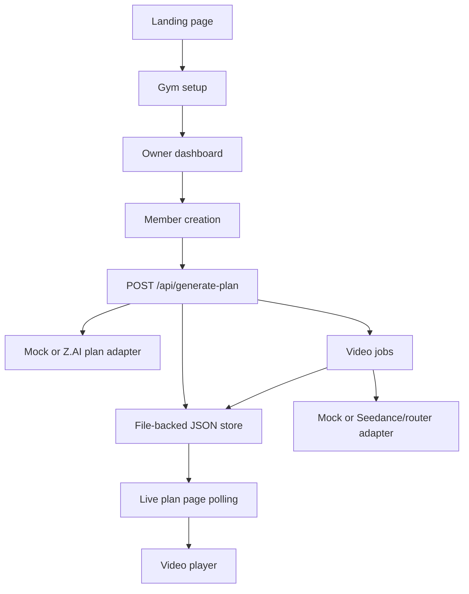

# Architecture

AI Fitness Coach is designed so the demo is reliable first, then easy to swap into real services.

## Runtime Shape

## Key Decisions

- Mock mode is the default because the demo should run without keys, quota, or provider downtime.
- File-backed persistence keeps local state across refreshes while staying easy to inspect.
- API contracts mirror the future production surface, so the persistence layer can move to Butterbase without redesigning the frontend.
- Video rendering is asynchronous even in mock mode, which lets the UI show the real product behavior: pending, generating, ready, failed, and retry.

## Production Path

1. Move `lib/butterbase.ts` from JSON files to Butterbase tables.
2. Deploy plan/video jobs as Butterbase functions or another durable worker.
3. Store generated media in Butterbase storage or a video CDN.
4. Add gym-owner authentication and member share links.
5. Replace mock metrics with retention and completion analytics.
